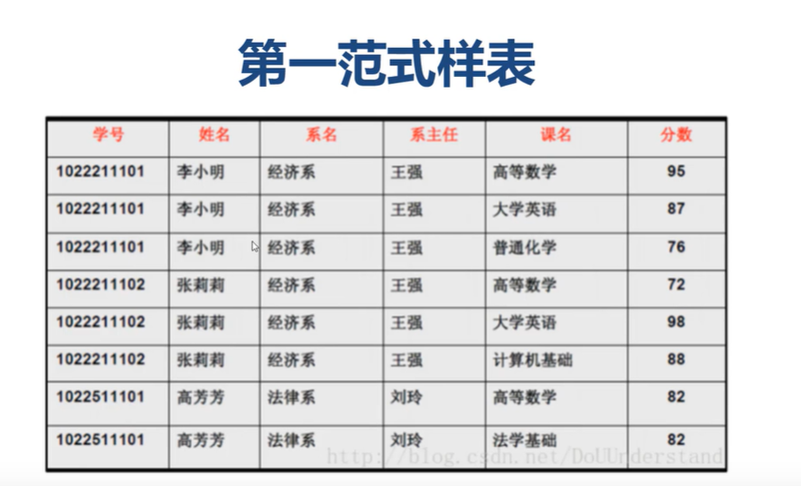
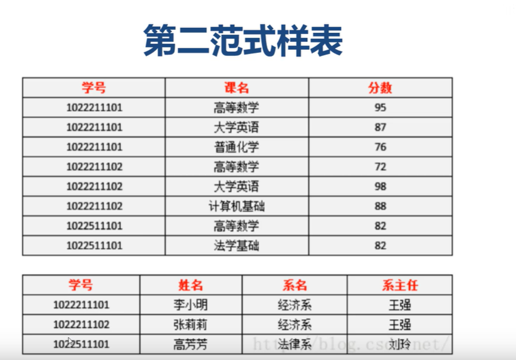
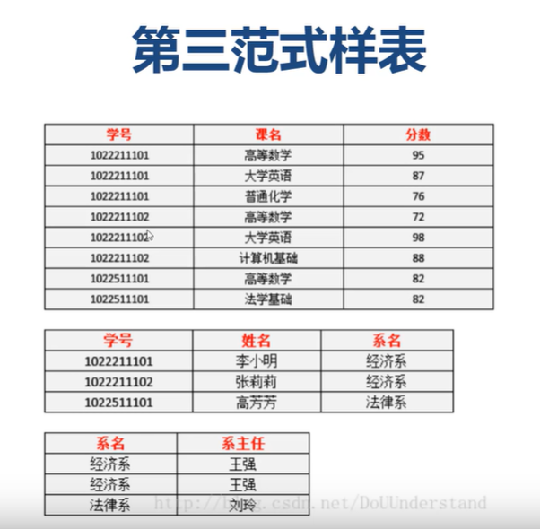
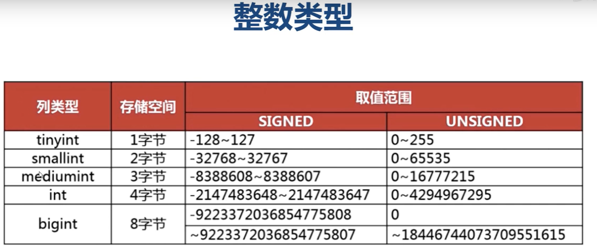
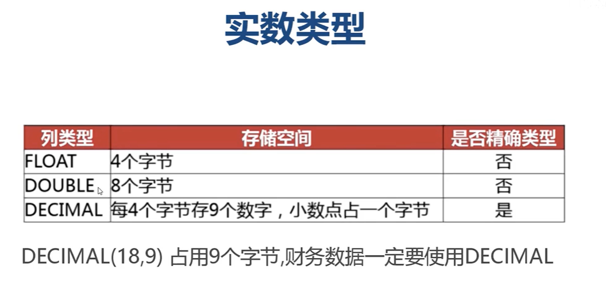
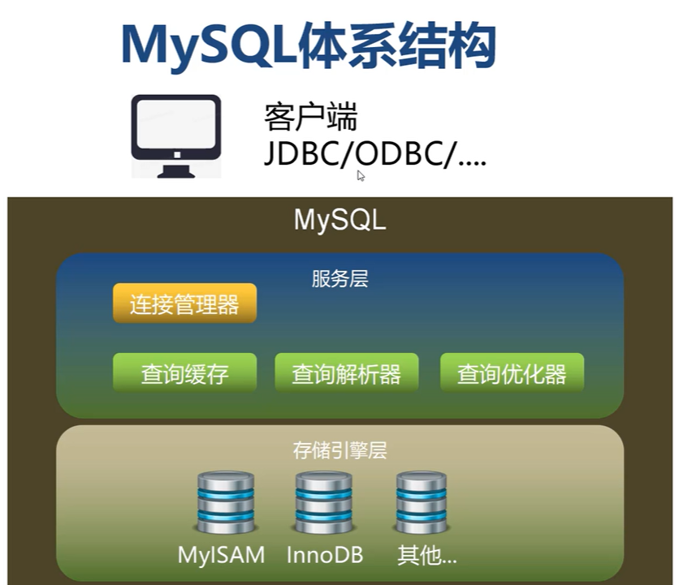
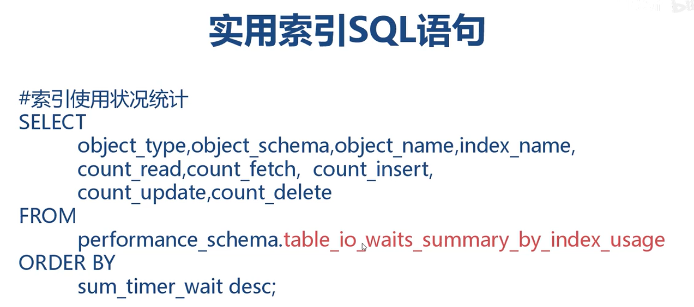

## MySQL性能的主要因素

1. 数据库结构设计
2. 数据库存储引擎
3. SQL语句的书写
4. 数据库参数配置
5. 服务器操作系统与硬件

## 三大范式

### 第一范式

1. 数据库所有字段都只有单一属性
2. 单一属性是由基本数据类型构成的
3. 数据库的表都是二维的



当我们修改器系名时，对应的系主任也要改变，数据冗余了

### 第二范式

1. 要求符合第一范式

2. 表必须有一个主键
3. 其他字段可由主键确定
4. 第二范式非递通过拆表减少数据冗余



学号核系主任并不是直接依赖关系，还可在拆分。系名和系主任才是直接依赖关系。

### 第三范式

1. 要求符合第二范式
2. 字段要求**直接依赖于主键**，不允许间接依赖
3. 第三范式目的在于拆分实体(完善主从表)




## 实体关系分析

1. 实体关系指系统事物之间的联系
2. 实体关系需要双向分析

一对多，多对一，多对多，一对一


## 自然主键于代理主键

自然主键是指事务属性中的自然唯一标示

代理主键是指与业务无关，无意义的数字序列化

## 字段类型的选择

### 字段类型的优先级

1、数字类型






2、日期类型与二进制类型


3、字符串类型


使用场景：

1. 长度波动大的数据

2. 字符串很少被变更的场景
3. 适合保存多字节字符


使用场景

1. 存储长度波动不大的数据，MD5摘要
2. 适合存储短字符串
3. 存储经常更新的字符串

## MySQL体系结构



_____

## 存储引擎

### InnoDB（5.5.8 为默认存储引擎）

表空间

1. 使用系统表空间 ibdataN（不利于管理，系统空间会产生IO瓶颈，难回收存储空间）
2. 独立表空间: tablename.ibd(推荐，使用optimize table命令回收存储空间)

支持事务

>  MySQL的锁

共享锁-读锁    					行级锁，对行进行加锁

独占锁(排它锁)  写锁		 表级锁，对表加锁

注：在innodb中国只有利用索引的更新，删除操作才可以使用行级锁，不能使用索引的写操作则是表锁。在实际中，一道写操作，一定要确保update/delete语句条件，要能够狗使用索引，否则会缩表，程序不具备开发性。

------

### MyISAM（5.5以前为默认的）

#### MyISAM特点

- 不支持事务
- 支持全文索引，支持text支持前缀索引
- 支持数据压缩
- 紧密存储，顺序读性能很好
- 表级锁，混合读写性能不佳，并发性差

#### MyISAM应用场景

- 非事务应用，例如：保存日志
- 只读类应用，报表数据，字典数据
- 空间类应用，开发GIS系统
- 系统临时表，SQL查询，分组的临时表引擎

------

### Memory存储引擎

#### Memory特点

- 不支持事务
- 内存读写，临时存储
- 超高的读写效率，比MyISAM高一个量级
- 表级锁，并发性差

#### Memory使用场景

- 读多写少的静态数据
- 充当缓存使用，保存高频访问静态数据
- 系统临时表

------

### CSV存储引擎

#### CSV特点

- 纯文本保存
- 不支持事务
- 不支持索引
- 不允许空列

#### CSV应用场景

- 数据交换/数据迁移
- 不依赖MySQL环境

-----


## 索引

B+Tree

- 为表建立“目录”
- 目的是防止全表扫描
- 存储形式是由存储引擎决定的。

#### 索引分类

>  根据存储结构：

BTree索引(B-Tree或者B+Tree)、Hash索引、Full-index全文索引、R-Tree索引。

> 应用层次来分

普通索引，所以索引，复合索引

> 根据数据的物理顺序与键值的逻辑(索引)顺序关系

聚集索引，非聚集索引。

#### MySQL常用的索引

- B+Tree索引，适用于范围查找

InnoDB于MyISAM采用的是B+Tree索引

B+Tree索引采用属性链表结构建立数据“目录”

官方推荐自增长索引作为主键，因为这个方便形成树。

- Hash索引，适用于精确查找

##### B+Tree索引

explain是解释计划，说明sql的执行情况

精准匹配，允许使用B Tree索引

范围匹配，也允许使用B Tree索引

查询优化器会自动进行类型类型转换，但仍然建议使用于定义相符的类型。

B Tree允许前缀查询

后缀查询于模糊匹配B Tree均不支持

<>与not in会导致不使用索引

##### Hash索引

- Hash索引基于哈希表实现
- 精确匹配所有所有列的查询才有效
- Hash所有未每个数据生成一个HashCode

特点

- Hash索引只包含哈希值和行指针
- 只支持精准匹配，不支持范围查询，模糊查询及排序
- Hash取值速度快，但所有选择性很低，不建议使用。

- MySQL目前只有Memory显式支持Hash索引。


InnoDB中的Hash索引

- InnoDB存储引擎只支持显示创建B Tree索引
- 数据精准匹配时MySQL会自动生成HashCode，存入缓存

### 索引的优点

- 索引大幅提升了数据的检索效率
- 索引吧随机IO，变成了顺序IO

索引不是越多越好

- 降低了写数据的效率
- 太多的索引增加了查询优化器的选择时间
- 太合理的使用索引，会大幅占用磁盘空间

### 索引的优化策略

什么情况下不会用索引

- 索引选择性太差
- <>      not in  无法使用索引
- is null   会使用到索引，is not null不会使用到索引
- where子句跳过左侧索引列，直接查询右侧索引字段

- 对索引列进行计算或者使用函数，将会使索引失效

- 当排序出现了索引左侧列时，则允许使用索引排序，左侧字段单字段排序时，索引支持升降序。

- 多字段下，左侧字段必须是升序的，且顺序不允许打乱



索引重新统计

analyze table t_content


optimize table t_content

优化表空间，释放表空间

-----

## 反范式设计

1、单表查询易于优化，易于管理

2、SQL语句简单，有利于程序开发，团队协作

3、存在数据冗余，写操作时，需要额外更新从表数据

4、不合理的反范式设计会让表变得臃肿不堪

---

## 多表关联优化

使用索引

---

## 慢SQL日志

```sql
#开启慢sql日志功能
set global slow_query_log=on
#慢sql执行时间阈值，
set global long_query_time = 0.001
#指定慢SQL文件名为slow-sql，慢sql日志保存在mysql/data目录下
set global slow_query_log_file="slow-sql.log"
#是否记录没有使用索引的SQL的语句
set global log_queries_not_using_indexes=on

```

----

## Explain执行计划

```
primary: 复杂查询中最外层的select
deriverd: 包含在from子句中的子查询。MySQL会将结果存放着一个临时表中，也称派生表
union: 在union中的第二个随后的select
union result: 从union临时表检索结果的select

partitions: 分取

#type 这一列表示关联类型或访问类型，即MySQL决定任何查找表中的行
#执行效率排序
1、system
2、const  mysql能对查询部分进行优化，并将其转化为一个常量，用于primary key 或者unique key的所有列与常数比较时，表最多有一个匹配行，读取1次，速度比较快
3、eq_ref   primary key 或 unique key索引的所有部分被连接使用，最多只会返回一条符合条件的记录，可能在const之外最好的连接类型了。
4、ref
5、fulltext
6、ref_or_null
7、index_merge
8、unique_subquery
9、index_subquery
10、range
11、index
12、All
```


filtered是一个百分比值，代表(rows+filtered)/100，这个结果用于前表产生交互。

extra  额外的信息

#distinct 一旦mysql找到了与行相联合匹配的行，就不在索索

#Using index:这发生在对表的请求列都是同一索引的部分的时候，返回的列数据只使用了索引中的信息，没有再去访问表中的行记录

using where 先读取整行数据，再按where条件进行检查符合就留下，不符合丢弃。

----

## 分区表

- 分区表就是把打表按条件单独存储到不同的"物理小表"中，在构"建出的完整"逻辑表"。


### 分区表的优点

- 更少的数据检索范围
- 拆分超级大的表，将部分数据加载到内存
- 分区表的数据更容易维护
- 分区表数据文件可以分布在不同的硬盘，并发IO
- 减少锁的范围，避免大表锁表
- 可独立备份，恢复分取数据

分区表的使用限制

1、查询必须包含分区列，不允许对分区列进行计算

2、分区列必须是数字类型

3、分区表不支持简历外键索引

4、建表时主键必须包含所有的列

5、最多1024个分区

### 数据分库

- 将数据库存放在多台MySQL服务器
- 缺点：数据分布不均匀，未能根本解决海量数据存储问题

中间件：Sharing Sphere

#### Sharding-JDBC

- 定位未轻量级Java框架，在Java的JDBC层提供的额外服务
- 他使用客户端直连数据库，以jar包形式提供服务
- 可理解未增强版的 JDBC驱动，完全兼容JDBC和各种ORM框架