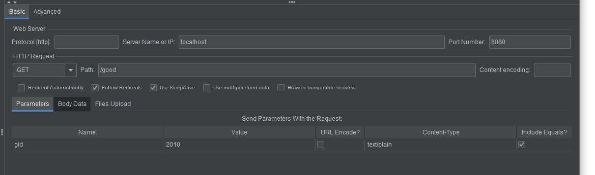
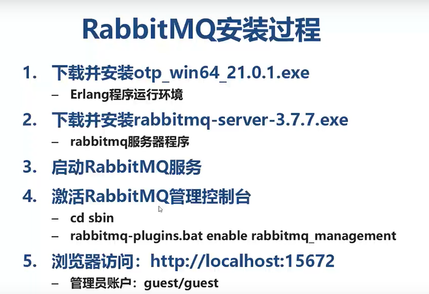

◆压力测试(Stress Test)，也称为强度测试、负载测试。压力测试是模拟实际应用的软硬件环境及用户使用过程的系统负荷，长时间或超大负荷地运行测试软件，来测试被测系统的性能、可靠性、稳定性等。

稳定的数据使用两种方式进行高并发处理

- 利用缓存(redis, memcached)
- 利用静态化技术转化为html

### 静态化技术

页面静态化指将动态页面变成html静态页面。动态页面便于管理。访问网页时还需要程序先处理一遍，导致访问速度相对较慢。静态页面访问速度块，不便于管理。

### Nginx

Nginx是一款轻量级的web服务器/反向代理服务器，特点是占有的内存少，并发能力强。

### 秒杀

特点：

1. 瞬间超高访问量
2. 商品总量有限，先到先得
3. 有明确的开始，结束时间

两个挑战

- 高并发，基本主流电商的秒杀QPS峰值都在100w+
- 避免超卖，避免购买商品人数不超过商品数量。

原因，多个线程同时访问了同一个值，并返回同一个值，导致了超卖。！！！

### 利用redis解决超卖

#### 为什么使用redis

- redis单线程模式
- 内存存储，高达100W QPS
- 分布式支持

将订单放入redis 的list中。当用户下单时，lpop,当用户重复下单时，rpop。

并将用户信息存入set中

### RabbitMQ使用Erlang开发

◆Erlang(['a:laen])是- -种通用的面向并发的编程语言,Erlang是一个结构化，动态类型编程语言，内建并行

计算支持。

◆使用Erlang来编写分布式应用要简单的多，Erlang运行时环境是一个虚拟机，有点像Java虚拟机，这样代码一经编译，同样可以随处运行。

### 利用MQ对秒杀削峰限流

